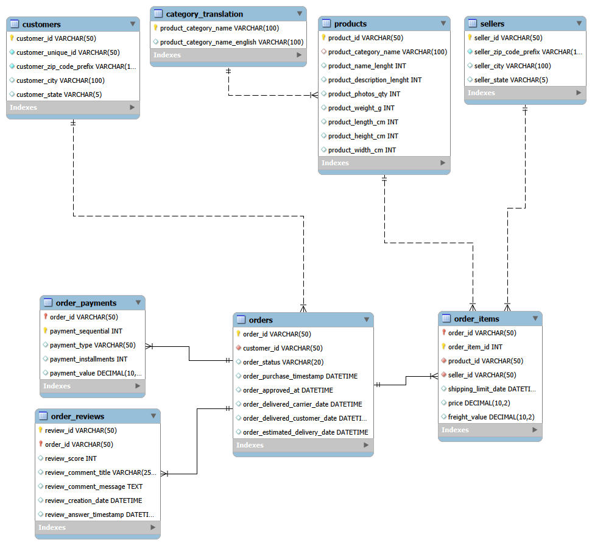

# Olist E-Commerce Analytics: Customer Retention & Supply Chain Bottlenecks

## Executive Summary
This project analyzes a 100,000+ row e-commerce database using advanced SQL to identify the root causes of customer churn. By building an RFM (Recency, Frequency, Monetary) segmentation model, a cohort retention matrix, and an end-to-end logistics performance tracker, the analysis reveals that a severe drop in repeat purchases is directly correlated with regional supply chain breakdowns and high late-delivery rates. 

## About the Dataset
The data utilized for this project is the **Brazilian E-Commerce Public Dataset by Olist**, sourced from [Kaggle](https://www.kaggle.com/datasets/olistbr/brazilian-ecommerce). 

Olist connects small businesses from all over Brazil to channels without hassle and with a single contract. The dataset consists of over 100,000 anonymized orders made at multiple marketplaces in Brazil from 2016 to 2018. It features multiple relational dimensions, including order status, pricing, payment, freight performance, customer location, and product attributes.

---

## Chapter 1: Customer Behavior & RFM Segmentation
To understand the baseline health of the customer base, I engineered an RFM model entirely in SQL using `NTILE()` window functions to segment customers based on their purchasing habits.

**Key Findings:**
* **Retention is a Critical Issue:** The largest segment is "Recent/Average Buyers" at 37.05% of the base, but a highly concerning 33.96% of customers are classified as "At Risk (Big Spenders)". 
* **The "At Risk" Profile:** These at-risk customers have not made a purchase in an average of 438 days, despite spending an average of 167.21 in the past. 
* **Untapped Potential:** Our "Champions" spend an impressive average of 371.77, but they represent a microscopic 0.55% (513 total users) of the entire customer base.

| Segment | % of Base | Avg. Days Since Last Order | Avg. Orders | Avg. Spend |
| :--- | :--- | :--- | :--- | :--- |
| Recent/Average Buyers | 37.05% | 137 | 1.00 | 160.36 |
| At Risk (Big Spenders) | 33.96% | 438 | 1.03 | 167.21 |
| Regular/Other | 24.98% | 317 | 1.03 | 153.43 |
| Loyal Customers | 3.47% | 207 | 1.22 | 249.20 |
| Champions | 0.55% | 95 | 2.19 | 371.77 |

*Data source: [rfm_segment_distribution.csv](query_results/rfm_segment_distribution.csv)*

---

## Chapter 2: Cohort Analysis (Customer Retention)
To investigate the high volume of "At Risk" customers, I utilized `DATE_FORMAT` to standardize purchase timestamps into baseline months and `PERIOD_DIFF` to calculate the exact lifecycle of each cohort, successfully pivoting the data into a 6-month retention matrix.

**Key Findings:**
* **The "One-and-Done" Phenomenon:** The matrix reveals a catastrophic drop-off immediately after Month 0. For example, during the peak holiday cohort of November 2017 (2017-11-01), the business acquired 7,060 new customers. 
* **Month 1 Churn:** By Month 1, only 40 of those 7,060 customers returned to make a second purchase. This near-zero retention rate is consistent across all monthly cohorts throughout 2017 and 2018.

| Cohort Month | Month 0 (Total) | Month 1 | Month 2 | Month 3 | Month 4 | Month 5 |
| :--- | :--- | :--- | :--- | :--- | :--- | :--- |
| 2017-09-01 | 4,004 | 28 | 22 | 11 | 18 | 9 |
| 2017-10-01 | 4,328 | 31 | 11 | 4 | 10 | 9 |
| 2017-11-01 | 7,060 | 40 | 26 | 12 | 12 | 13 |
| 2017-12-01 | 5,338 | 11 | 15 | 18 | 14 | 11 |
| 2018-01-01 | 6,842 | 23 | 25 | 20 | 20 | 11 |

*Data source: [cohort_analysis.csv](query_results/cohort_analysis.csv)*

---

## Chapter 3: Logistics & Supply Chain Bottlenecks
A poor delivery experience is the leading cause of e-commerce churn. I utilized `DATEDIFF` functions to extract the exact transit times between specific supply chain milestones (Approval -> Carrier -> Delivery) to identify logistical bottlenecks.

**Key Findings:**
* **Regional Freight Failures:** The state of Alagoas (AL) suffers from a massive 23.93% late delivery rate, requiring an average of 21.1 days just for the carrier to complete transit. 
* **High-Volume Bottlenecks:** This is not just a rural issue. Rio de Janeiro (RJ), one of the highest-volume states with 12,350 total orders, has a 13.47% late delivery rate.
* **The Benchmark:** In contrast, São Paulo (SP) successfully processes over 40,000 orders with only a 5.89% late delivery rate and an average delivery time of just 8.7 days.

| State | Total Orders | Late Delivery Rate | Avg. Delivery Days | Avg. Days in Transit |
| :--- | :--- | :--- | :--- | :--- |
| AL | 397 | 23.93% | 24.5 | 21.1 |
| MA | 717 | 19.67% | 21.5 | 17.9 |
| RJ | 12,350 | 13.47% | 15.2 | 11.9 |
| SP | 40,494 | 5.89% | 8.7 | 5.6 |

*Data source: [logistics_performance.csv](query_results/logistics_performance.csv)*

The data heavily implies that Olist must renegotiate its third-party logistics (3PL) carrier contracts outside of São Paulo. The massive delays occurring while packages are "In Transit" are directly cannibalizing the customer retention rates identified in Chapter 2. 

---

## Technical Skills Demonstrated
* **Database Administration (DBA):** Engineered a relational database from raw CSVs, handled `NULL` data anomalies, bypassed strict mode constraints for data cleansing, and established a star-schema architecture using Foreign Keys.
* **Advanced SQL Querying:** Utilized Common Table Expressions (CTEs) for modular logic, `NTILE()` Window Functions for percentile ranking, and complex `JOIN` mechanics for cohort mapping.
* **Date & Time Manipulation:** Standardized timestamps using `DATE_FORMAT` and calculated precise supply chain lifecycles using `DATEDIFF` and `PERIOD_DIFF`.
* **Business Logic Translation:** Applied conditional aggregation (`CASE WHEN` pivoting) to transform raw, transactional logs into executive-ready retention matrices and RFM segments.
